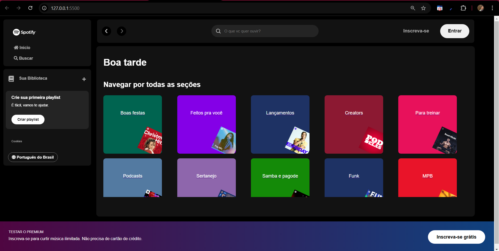
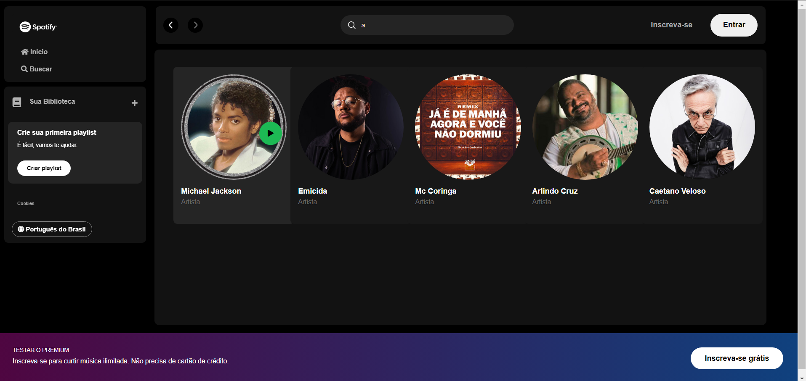

# Spotify Clone - Imersão Alura

Este é um projeto de recriação da interface do Spotify, desenvolvido durante a imersão de Front-End da Alura. O projeto inclui funcionalidades como pesquisa de músicas e saudações dinâmicas com base no horário do dia (Bom dia, Boa tarde, Boa noite).

## Funcionalidades

- *Interface do Spotify*: Design inspirado na interface do Spotify.
- *Pesquisa de Músicas*: Permite ao usuário pesquisar por músicas na lista de faixas.
- *Saudações Dinâmicas*: O site exibe mensagens de "Bom dia", "Boa tarde" ou "Boa noite", dependendo da hora do dia.
- *API Fake*: Uma API fake foi criada para simular uma base de dados de músicas.

## Tecnologias Utilizadas

- *HTML*: Estruturação da interface.
- *CSS*: Estilização e layout responsivo.
- *JavaScript*: Funcionalidades de pesquisa e saudações dinâmicas.
- *API Fake*: Uma API fictícia local para simular a busca de músicas.

